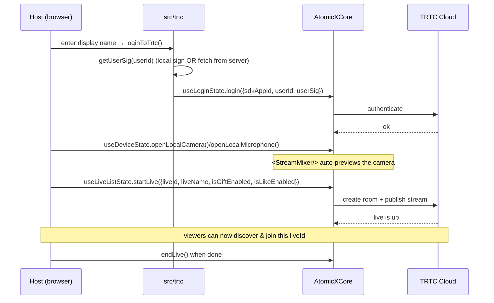
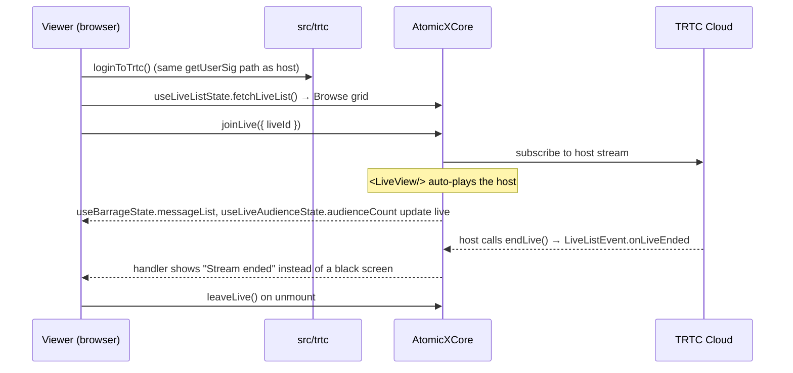

# Architecture

This document is the mental model for the repo: what the major SDK pieces do,
and how a "go live" and a "join" flow move through them.

## The layers

```
┌──────────────────────────────────────────────────────────────┐
│  Vue pages (BrowsePage / GoLivePage / WatchPage)              │  ← what the user sees
├──────────────────────────────────────────────────────────────┤
│  Feature components (LiveChat, ViewerList, GiftBar,           │  ← thin UI over SDK state
│  CoGuestPanel, CoHostPanel, DeviceSelector, DevModeBanner)    │
├──────────────────────────────────────────────────────────────┤
│  src/trtc/  (getUserSig, loginToTrtc, session, config)        │  ← OUR glue / credential abstraction
├──────────────────────────────────────────────────────────────┤
│  tuikit-atomicx-vue3  (AtomicXCore Web Core SDK)              │  ← the SDK: components + state hooks
│    components: LiveView, StreamMixer                          │
│    state hooks: useLoginState, useDeviceState,                │
│      useLiveListState, useBarrageState,                       │
│      useLiveAudienceState, useLiveGiftState,                  │
│      useCoGuestState, useCoHostState                          │
├──────────────────────────────────────────────────────────────┤
│  Tencent RTC cloud  (rooms, media routing, signalling)        │
└──────────────────────────────────────────────────────────────┘
```

The golden rule: **our app only ever talks to `src/trtc/` and the SDK hooks.**
The credential complexity (local vs server signing) is hidden behind
`getUserSig()`, so every page is identical regardless of mode.

## The two key SDK components

| Component | Used by | What it does |
|---|---|---|
| **`StreamMixer`** | Host (GoLivePage) | Renders the host's outgoing/preview canvas. Once you open the camera with `useDeviceState`, it auto-previews; once you `startLive`, it's what your audience receives. |
| **`LiveView`** | Audience (WatchPage) | Renders the audience video canvas and auto-plays the host's stream after you `joinLive`. |

You don't manually wire `<video>` elements or attach MediaStreams — the SDK
components own the rendering. Your job is to drive the **state hooks**.

## The state hooks (composables)

Each hook is a Vue composable returning reactive refs + action methods. The ones
this demo uses:

- **`useLoginState`** — `login({ sdkAppId, userId, userSig })`. Must succeed
  before *anything else* works.
- **`useDeviceState`** — `openLocalCamera()`, `openLocalMicrophone()`,
  `cameraList`, `setCurrentCamera()`, `updateVideoQuality()`.
- **`useLiveListState`** — the room lifecycle: `fetchLiveList()`, `startLive()`,
  `joinLive()`, `leaveLive()`, `endLive()`, plus `subscribeEvent()` for passive
  events (`LiveListEvent.onLiveEnded`, `onKickedOutOfLive`).
- **`useBarrageState`** — chat: `messageList`, `sendTextMessage()`.
- **`useLiveAudienceState`** — `audienceCount`, `audienceList`, `fetchAudienceList()`.
- **`useLiveGiftState`** — `sendLikes()`, `totalLikeCount`, `sendGift()`, `giftInfoList`.
- **`useCoGuestState`** — guest-star: `applyForSeat()`, `applicants`, `acceptApplication()`.
- **`useCoHostState`** — host PK: `getCoHostCandidates()`, `requestHostConnection()`, `connected`.

## Flow 1 — Going live (host)



## Flow 2 — Joining a stream (viewer)



The event subscription in Flow 2 is what makes the UX feel finished: without
handling `onLiveEnded` / `onKickedOutOfLive`, a viewer would stare at a frozen
black frame when the host stops or a moderator removes them. See
`web/src/pages/WatchPage.vue`.

## Where the credential abstraction lives

```
src/trtc/
├── config.ts          # reads VITE_* env once; exposes trtcConfig + isLocalSigMode
├── genTestUserSig.ts   # DEV-ONLY browser-side UserSig signer (HMAC-SHA256 + zlib)
├── userSig.ts          # ★ getUserSig(userId): the ONE switch between local/server
├── login.ts            # loginToTrtc(): getUserSig → SDK login → update session
├── session.ts          # reactive { userId, userName, isLoggedIn }
└── index.ts            # barrel export
```

If you remember one file, remember **`userSig.ts`**. Everything else in the app
is mode-agnostic.
